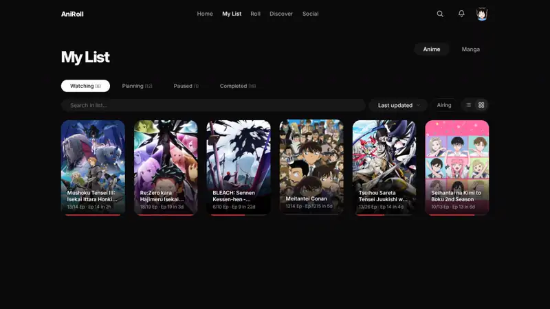

# AniRoll

**Can't decide what to watch? Roll for it.** AniRoll is an anime tracker on top of your
[AniList](https://anilist.co) account: it picks tonight's show from your Planning list, runs watch
parties with friends, tracks what you play in Jellyfin, and shows the week's episodes at a glance.

Live at **[aniroll.app](https://aniroll.app)**. Log in with AniList; your list stays on AniList.

## Read this first

This repository is a **showcase, not a kit**. It shows how AniRoll is built. It is not meant to be
cloned and run as your own copy.

**Everything AniRoll stands on is here**: talking to a rate-limited API with no backend of its own
in between, caching that keeps working offline, keeping two accounts in one browser apart, writing to
someone's list only when that is safe, a small server that holds secrets, two complete designs, and
no bundler anywhere.

**Three pieces are cut on purpose**: Roll, the Watch Party and the taste match. They are what makes
AniRoll *AniRoll*. Their files are here as stubs with the same exports, so you can see exactly where
they plug in and what they get to work with. How they work inside is the part you have to think
through yourself. [More on the cut](#the-deliberate-cut).

## What it does

- **Roll**: a slot-machine reel picks from your Planning list, filtered by length, score and genre,
  optionally with recommended titles that aren't on your list yet.
- **Watch Party**: the host counts episodes, guests follow along and their AniList moves with them.
- **Home**: the show you're on with a live countdown to its next episode, then everything else you watch.
- **Jellyfin live tracking**: an episode played past 90% counts as watched, rewatches included.
- **Calendar**: the week (or month) with air times and where you stand on each show.
- **Recommendations with a taste match** from your own scores, genres and tags.
- **My List**, **Social** (your AniList feed), **scores in your AniList format**, installable as a PWA.
- **Two designs**: AniRoll's own, or **Material 3 Expressive** in the colours of the show you watched last.

| AniRoll | Material 3 Expressive |
|---|---|
|  |  |
| Monochrome and cinematic, one accent colour of your choice. | Themed from your last show: its cover becomes the wallpaper, every surface follows. |

| My List | Calendar |
|---|---|
|  |  |
| **Taste match** | **Home** |
|  |  |

  
  &nbsp;&nbsp;
  

Screenshots and clips show a made-up demo account; the shows are real, from AniList.

## How it is built

Each section below is a problem AniRoll has to solve, how it solves it, and where to read the code.

### A rate-limited API as the only backend

The browser talks straight to the [AniList GraphQL API](https://docs.anilist.co). AniList allows about
30 requests a minute when it is under load, and every open tab counts against that. So `js/api.js`
does not just send queries:

- **A budget shared by every tab**: at most 20 requests per rolling minute, counted in `localStorage`
  and claimed under `navigator.locks`, so two tabs can't both take the last slot.
- **Caching in two layers**: RAM (LRU, 50 MB) and IndexedDB (200 MB, oldest first), each kind of data
  with its own lifetime. If a refresh fails, the old answer is shown instead of an empty page.
- **One request for identical queries** that are in flight at the same time.
- **A pause on 429**: for five minutes nothing goes out, reads come from the cache, and changes wait in
  a queue that drains a few at a time once AniList answers again.

### One browser, more than one account

Everything an account caches or queues is marked with that account. Cache keys carry the account id
(never the token), so a different login on the same browser never sees someone else's list state. A
queued save only goes out for the account that made it. Logging out deletes that account's cache.

### Writing to someone's list only when it is safe

Jellyfin playback moves your AniList forward (`js/jellyfin.js`, and the same rules in `api/server.js`).
A wrong guess would change someone's list on the wrong show, so matching is strict: a year in either
title has to agree, the episode has to fit, shows that share a name are told apart first, and if in
doubt nothing is written. A correction by hand wins over a later playback.

### A small server that holds secrets

`api/server.js` is plain Node without a framework. It serves the Jellyfin relay and webhook, background
sync, share pages and an error log. Jellyfin keys and AniList tokens are encrypted with AES-256-GCM,
and the key comes from outside the data volume (the server refuses to start without it). Data files
are written atomically. The relay forwards only the few Jellyfin endpoints AniRoll uses, and it refuses
private addresses at connect time, so DNS tricks can't point it at localhost.

### No bundler

Plain ES modules, loaded by the browser as they are. Every import carries `?v=N`, raised on each
release, so a browser never mixes old and new modules. With no bundler and no inline script, the
Content Security Policy can say `script-src 'self'`: only AniRoll's own files run, even if a bug ever
let markup through the escaping.

### Two designs, one app

`js/design.js` switches between AniRoll's own look and Material 3 Expressive. Material 3's whole
light and dark scheme comes from one seed colour, the cover colour of the show you watched last,
through Google's Material Color Utilities. Its wallpaper is that cover, blurred once on a tiny canvas
instead of with an expensive CSS blur. `js/m3.js` adds what CSS alone can't: the hero, the widgets
and a cursor that takes the shape of what it points at.

### Pages that don't trip over each other

`js/router.js` gives every navigation a number. A slow page that answers after you already moved on
cleans up after itself instead of drawing over the page you are on now. Dialogs (`js/a11y.js`) trap
focus, close on Escape, stack, and return focus to what opened them. *Reduce motion* turns off
GSAP and Lenis entirely.

## Finding your way around

**Start here:** `index.html` loads `js/app.js`, which sets up the shell (navigation, avatar menu,
settings, background jobs) and hands the URL to `js/router.js`. The router maps `#/list`, `#/roll`, …
to a module in `js/pages/`, and each page exports one `render({ content, query })`.

| Where | What it holds |
|---|---|
| `js/api.js` | Everything that talks to AniList: queries, the request budget, the cache, the queue for saves |
| `js/store.js` | Small shared state (user, settings), escaping, toasts, score formats, events other modules listen to |
| `js/auth.js` | The AniList login token, kept in `localStorage` |
| `js/pages/*.js` | One module per page: `home`, `list`, `calendar`, `detail` (the slide-in panel), `social`, `search`, … |
| `js/upnext.js`, `js/home-cinema.js` | What Home says about your list (next episode, what's waiting, the week) and AniRoll's Home on top of it |
| `js/design.js`, `js/m3.js`, `css/m3.css` | The design switch, Material 3's generated palette and its extra pieces |
| `js/jellyfin.js`, `js/nowplaying.js` | Jellyfin: matching what you played to an AniList entry, the *Now watching* chip |
| `js/a11y.js`, `js/select.js` | Dialogs, keyboard activation, styled selects |
| `js/whatsnew.js` | The changelog and the pop-up for returning visitors |
| `api/server.js` | The Node backend |
| `css/style.css` | AniRoll's own design; `css/m3.css` is only loaded in Material 3 |

### One action, followed through the code

Pressing **+1** on a Continue Watching card (`js/pages/home.js`):

1. The card updates at once: progress text, bar, and the button disappears on the last episode.
2. `api.progressVars()` works out what else changes with the episode (a planned show becomes
   *Watching*, the last episode completes it or counts a rewatch, start and end dates get filled in),
   then `api.saveMediaListEntry()` sends it.
3. Saves for the same entry are chained, so three quick clicks arrive at AniList in order, and only the
   newest target is sent.
4. `api.js` takes a slot from the request budget. If AniList is rate limiting, the save waits in the
   account's queue and goes out later; the card keeps the new number.
5. The card emits `aniroll:watched` (`js/store.js`): Material 3 listens and re-colours the app from
   the show you just watched. Home's hero presses this same card's button, so there is one code path for saving.

## The deliberate cut

| Piece | Files | What it builds on, all of it here |
|---|---|---|
| **Roll** | `js/pages/roll.js`, `js/reel.js` | `api.getMediaList()` and `api.getRecommendations()`, `api.saveMediaListEntry()`, the detail panel |
| **Watch Party** | `js/pages/watchparty.js`, `api/party.js` | `api.getUserMediaProgress()` and `api.saveMediaListEntry()`, background sync (`js/background.js`, `api/server.js`) |
| **Taste match** | `js/taste.js` | Your list with its scores, genres and tags; `api.getTasteProfile()`, the recommendations and the detail page call it |

The stubs keep every export, so the rest of the app loads and runs without them. The server runs
without `api/party.js`, too. This repository only ever held published snapshots, so older commits don't
contain these pieces either. To see them in action, [try AniRoll](https://aniroll.app).

## How it is checked

- `tools/e2e/`: every page in Chromium (Playwright) against a mocked AniList: navigation, dialogs and
  keyboard, both designs, the changelog, and a check that two accounts in one browser never share
  cached answers or queued saves
- `tools/api-test/`: the Jellyfin matcher in the server and the browser gives the same answer for the
  same cases, the relay refuses private addresses, posts are escaped, data files survive a crash mid-write

AniRoll is built with Vanilla JS, [GSAP](https://gsap.com), [Lenis](https://lenis.darkroom.engineering),
the self-hosted [Inter](https://rsms.me/inter/) font and Material Symbols. All anime data comes from AniList.
